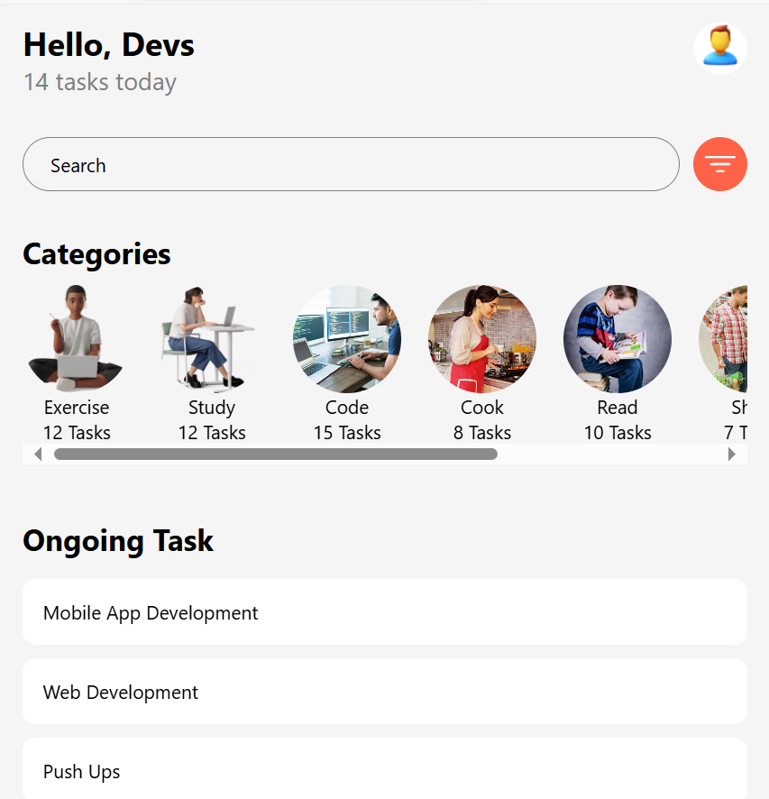

# Task Manager App

This is a Task Manager App built with React Native. It helps users manage and track their tasks in different categories. The app is structured with modular custom components to make the code more organized and maintainable.

## Components

### Header
- **File:** `components/Header.js`
- **Description:** Displays the greeting message, today's task count, and the profile image of the user.
- **Usage:** Imported and used in `App.js`.

### SearchBar
- **File:** `components/SearchBar.js`
- **Description:** Includes a search bar for task search functionality and a filter button for additional filtering options.
- **Usage:** Imported and used in `App.js`.

### Categories
- **File:** `components/Categories.js`
- **Description:** Shows a horizontal list of different task categories. Each category displays an icon, name, and the number of tasks.
- **Usage:** Imported and used in `App.js`.

### OngoingTasks
- **File:** `components/OngoingTasks.js`
- **Description:** Displays a list of ongoing tasks. Each task item shows the task name.
- **Usage:** Imported and used in `App.js`.

## Screenshots

### Home Screen


## Getting Started

### Prerequisites

- [Node.js](https://nodejs.org/) (version 14 or later)
- [Expo CLI](https://docs.expo.dev/get-started/installation/)

### Installation

1. Clone the repository:
   ```bash
   git clone https://github.com/your-username/task-manager-app.git
   cd task-manager-app
